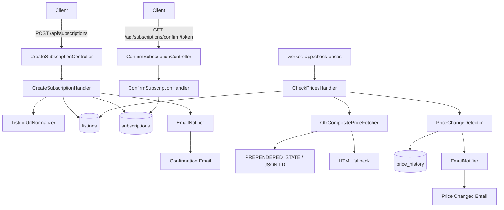

# OLX Price Watcher

OLX Price Watcher is a PHP/Symfony service for subscribing to OLX listing price changes. A user submits a listing URL and an email address, confirms the subscription from an email, and then the service checks the price in the background and sends an email when the price changes.

## Task

The service must make it possible to track price changes for an OLX listing:

1. The service must provide an HTTP method for subscribing to price changes. The method receives a listing URL and the email address where notifications should be sent.
2. After a successful subscription, the service must track the listing price and send notifications to the provided email address.
3. If several users subscribe to the same listing, the service must not check that listing price redundantly.

The delivered result includes:

- a service flow diagram and a short description;
- a link to the code repository;
- price-change subscription;
- price-change tracking;
- email notification sending;
- implementation in PHP.

Additional requirements:

- the service runs in Docker containers;
- tests are written with more than 70% coverage;
- user email confirmation is implemented.

Full single-file documentation: [doc/olxpricewatcher-en.md](doc/olxpricewatcher-en.md).

Repository:

- SSH: `git@github.com:ukrweb/olxpricewatcher.git`
- HTTPS: `https://github.com/ukrweb/olxpricewatcher`

## Solution Overview

The service has four main parts:

- HTTP API for creating and confirming subscriptions.
- PostgreSQL for storing listings, subscriptions, and price history.
- A separate Docker worker for periodic price checks.
- Symfony Mailer for confirmation, price-change, and listing-unavailable emails.

The main invariant: one unique OLX listing is checked once per worker cycle, regardless of the number of subscribers. If 10 email addresses subscribe to one listing, the service makes one request to OLX and then sends notifications to active subscribers.



## Stack

- PHP 8.3
- Symfony 7
- PostgreSQL 16
- Doctrine ORM і Migrations
- Symfony HttpClient
- Symfony Mailer
- Symfony Console
- Symfony Translation
- Symfony Monolog Bundle
- Swagger UI / OpenAPI
- PHPUnit
- PHPStan
- PHP_CodeSniffer
- Docker і Docker Compose
- Mailpit для локального перегляду листів

Required to run:

- Docker
- Docker Compose v2
- Git

Local PHP/Composer is not required: dependencies are installed inside the Docker image during `docker compose up --build`.

## Installation

1. Clone the repository:

```bash
git clone git@github.com:ukrweb/olxpricewatcher.git
cd olxpricewatcher
```

2. Create `.env`:

```bash
cp .env.example .env
```

3. Start containers:

```bash
docker compose up -d --build
```

During the build, Docker runs `composer install`. There is no need to run `composer install` on the host. If `composer.json` or `composer.lock` changed after the build, run:

```bash
docker compose exec app composer install
```

4. Run migrations:

```bash
docker compose exec app php bin/console doctrine:migrations:migrate
```

5. Check the service:

- Home page: [http://localhost:8000/](http://localhost:8000/)
- Swagger UI: [http://localhost:8000/api/doc](http://localhost:8000/api/doc)
- OpenAPI YAML: [http://localhost:8000/openapi.yaml](http://localhost:8000/openapi.yaml)
- Health check: [http://localhost:8000/health](http://localhost:8000/health)
- Mailpit: [http://localhost:8025](http://localhost:8025)

## Main Commands

Create a subscription:

```bash
curl -i -X POST http://localhost:8000/api/subscriptions \
  -H 'Content-Type: application/json' \
  -d '{"url":"https://www.olx.ua/d/uk/obyavlenie/example-IDdemo123.html","email":"subscriber@example.com"}'
```

After that, open Mailpit, find the confirmation email, and follow the confirmation URL.

Confirm a subscription manually:

```bash
curl -i http://localhost:8000/api/subscriptions/confirm/<token>
```

Run a price check manually:

```bash
docker compose exec app php bin/console app:check-prices
```

The worker also runs automatically in the separate `worker` container.

## `.env` Configuration

Main variables:

- `PROJECT_NAME` - service name for Docker object names and email text.
- `APP_BASE_URL` - base URL for confirmation links.
- `POSTGRES_*` - PostgreSQL settings.
- `MAILER_DSN` - SMTP DSN. Locally, Mailpit is used by default: `smtp://mailpit:1025`.
- `MAIL_FROM` - sender address.
- `LOCALE` - plain-text email language via Symfony Translation: `ua` or `en`; unknown values fall back to `ua`. Texts are stored in `translations/emails.ua.yaml` and `translations/emails.en.yaml`.
- `EMAIL_RATE_LIMIT_SECONDS` - minimum number of seconds between confirmation emails for the same email address.
- `OLX_CHECK_INTERVAL_FROM_SECONDS` and `OLX_CHECK_INTERVAL_TO_SECONDS` - random interval between worker cycles.
- `OLX_UNAVAILABLE_NOTIFICATION_THRESHOLD` - number of consecutive `not_found` checks after which active subscribers receive a listing-unavailable email.
- `OLX_HTTP_TIMEOUT_SECONDS` and `OLX_USER_AGENT` - HTTP request settings for OLX.
- `SUBSCRIPTION_CONFIRMATION_TTL_HOURS` - confirmation token lifetime.

`DATABASE_URL` is not duplicated in `.env.example`: Docker Compose builds it from PostgreSQL variables and passes it to `app` and `worker`. Inside containers, the database is available as `database:5432`; `POSTGRES_PORT` is only needed for host access.

If you changed `.env` while containers are already running, the safest option is to recreate containers completely:

```bash
docker compose down
docker compose up -d --build
```

For example, if you returned to local email testing with:

```env
MAILER_DSN=smtp://mailpit:1025
```

after `down/up -d --build`, verify that the container really sees the Mailpit DSN:

```bash
docker compose exec app printenv MAILER_DSN
docker compose exec app php bin/console debug:config framework mailer
```

The output should contain `smtp://mailpit:1025`. If `mailer:test` returns an error like `550 5.7.1 Sending from domain example.com is not allowed`, it is almost certainly a live SMTP provider response, not Mailpit. In that case, check whether `MAILER_DSN` is overridden in `.env.local`, `.env.dev`, `docker-compose.yml`, or environment variables:

```bash
grep -R "MAILER_DSN\|smtp-relay\|mailtrap\|demomailtrap\|sandbox.smtp" -n . --exclude-dir=vendor --exclude-dir=var
```

## Email and Mailpit

Local emails go to Mailpit:

[http://localhost:8025](http://localhost:8025)

The service sends:

- subscription confirmation email;
- price-change email;
- listing-unavailable email after repeated confirmed `404` or `410` `not_found` responses.

Unavailable detection distinguishes confirmed absence from temporary failures:

- HTTP `404` and `410` are `not_found` and increment `consecutive_not_found_count`.
- HTTP `5xx`, timeouts, and parsing failures are `parse_error` and increment `consecutive_fetch_error_count`.
- Listing-unavailable email is triggered only by the `not_found` threshold, not by fetch errors, and is sent only once until the listing becomes available again.

Email rendering is split by responsibility: `EmailFactory` creates the Symfony `Email` and sets sender/recipient/subject/body, while `SymfonyEmailTemplateRenderer` gets subject/body from Symfony Translation domain `emails`. The language is controlled by `LOCALE`: `ua` or `en`; unknown values fall back to `ua`. The site name in emails is injected from `PROJECT_NAME`.

For real SMTP, change `MAILER_DSN` in `.env`. Do not commit real SMTP credentials.

Public subscription endpoints can be used to send confirmation emails to third-party addresses. `EMAIL_RATE_LIMIT_SECONDS` protects confirmation emails from repeated sends to the same email address. Throttling is checked before the initial OLX fetch, so throttled requests do not spend OLX requests and do not create new listings/subscriptions. Throttled requests return HTTP `429 confirmation_throttled`; if there is no existing subscription to reuse, no new pending subscription is created. This is not a complete anti-spam system. For production, add broader rate limiting, CAPTCHA, IP throttling, unsubscribe links, and sender reputation controls.

If Symfony Mailer cannot send the confirmation email, the API returns HTTP `502` with a safe JSON message:

```json
{
  "status": "error",
  "message": "Unable to send confirmation email."
}
```

### Live SMTP Testing

For additional testing of email delivery through real SMTP, [Mailtrap Email Sending](https://mailtrap.io/) was used. This makes it possible to verify not only local Mailpit, but also the full path from Symfony Mailer through an external SMTP provider to a real mailbox.

When switching from Mailpit to live SMTP, it is important to:

- replace `MAILER_DSN` in `.env` with the provider DSN;
- set `MAIL_FROM` to a domain/address allowed by the SMTP provider;
- recreate containers with `docker compose down` and `docker compose up -d --build`;
- verify the actual DSN with `printenv MAILER_DSN` and `debug:config framework mailer`.

The error `550 5.7.1 Sending from domain example.com is not allowed` means the live SMTP provider rejected the sender address. For Mailtrap, use an allowed sender, for example an address from a domain configured in Mailtrap.

## Worker

The project uses a separate Docker container named `worker`, not cron or supervisor. This is simpler for Docker: one main process per container and separate logs for the HTTP app and background checks.

The worker runs:

```bash
php bin/console app:check-prices
```

After each full cycle, it waits for a random time between `OLX_CHECK_INTERVAL_FROM_SECONDS` and `OLX_CHECK_INTERVAL_TO_SECONDS`. If `FROM > TO`, `docker/worker/run.sh` exits with an error so the configuration problem is visible.

## Logs

Application and worker logs are written to standard Symfony/Monolog output and are visible in Docker logs:

```bash
docker compose logs -f app
docker compose logs -f worker
```

Logged operational events include OLX request status/latency, extractor source used, subscription creation failures, mail transport failures, and worker listing status transitions. Logs must not include `MAILER_DSN`, SMTP passwords/API keys, confirmation tokens, full OLX HTML responses, or email bodies.

## Quality Checks

After a clean clone or unpacking the project, Git inside the Docker container may show this warning:

```text
fatal: detected dubious ownership in repository at '/app'
```

This happens because the file owner on the host differs from the user inside the container. Git must be configured inside the container, because running `git config --global --add safe.directory /app` on the host changes the host Git config and does not help the container.

Run:

```bash
docker compose exec app git config --global --add safe.directory /app
```

After that, run quality commands:

```bash
docker compose exec app composer cs-check
docker compose exec app composer phpstan
docker compose exec app composer test
docker compose exec app composer coverage
docker compose exec app composer qa
```

`composer qa` runs CodeSniffer, PHPStan, and PHPUnit. `composer coverage` prints the coverage summary for `src`; the project has achieved more than 70% coverage.

## OLX Price Extraction Options

Several approaches were considered:

- GraphQL/internal API: rejected because there is no stable public request for one listing; indirect requests depend on `sellerId` and pagination.
- Next.js data endpoint `/_next/data/{buildId}/...json`: rejected because `buildId` changes after deployments and requires dynamic discovery.
- `window.__PRERENDERED_STATE__`: selected as the main source because the data is already present in server-rendered HTML.
- JSON-LD and HTML parsing: kept as fallbacks for resilience.

Final extraction order:

1. `window.__PRERENDERED_STATE__`
2. JSON-LD
3. HTML fallback

The service does not bypass CAPTCHA, authorization, rate limits, and does not use proxy rotation.

## Common Situations

If `POST /api/subscriptions` returns a DB connection error, check that containers are running, migrations have been executed, and `DATABASE_URL` in `docker compose config` contains `database:5432`, not `localhost:5432`.

If emails do not appear in Mailpit, check the actual mailer DSN inside the container:

```bash
docker compose exec app printenv MAILER_DSN
docker compose exec app php bin/console debug:config framework mailer
```

If it is not `smtp://mailpit:1025`, update `.env`, then run:

```bash
docker compose down
docker compose up -d --build
```

If Swagger UI does not open, check:

- [http://localhost:8000/api/doc](http://localhost:8000/api/doc)
- [http://localhost:8000/swagger.html](http://localhost:8000/swagger.html)
- [http://localhost:8000/openapi.yaml](http://localhost:8000/openapi.yaml)

If you need to fully delete local PostgreSQL data:

```bash
docker compose down -v
```

Normal `docker compose down` does not delete the named volume with DB data.
