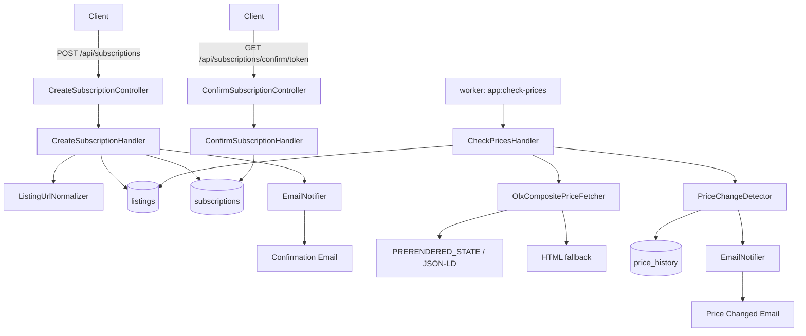

# OLX Price Watcher

OLX Price Watcher - це PHP/Symfony сервіс для підписки на зміну ціни оголошення OLX. Користувач надсилає посилання на оголошення та email, підтверджує підписку з листа, а сервіс далі перевіряє ціну у фоні та надсилає email, коли ціна змінюється.

## Завдання

Необхідно реалізувати сервіс, що дає змогу стежити за зміною ціни оголошення на OLX:

1. Сервіс повинен надати HTTP метод для підписки на зміну ціни. На вхід метод отримує посилання на оголошення та email, на який надсилати повідомлення.
2. Після успішної підписки сервіс повинен стежити за ціною оголошення і надсилати повідомлення на вказаний email.
3. Якщо кілька користувачів підписалися на одне й те саме оголошення, сервіс не повинен зайвий раз перевіряти ціну оголошення.

Результати роботи включають:

- схему/діаграму роботи сервісу та короткий опис;
- посилання на репозиторій з кодом;
- підписку на зміну ціни;
- відстеження змін ціни;
- надсилання повідомлення на пошту;
- реалізацію мовою PHP.

Ускладнення:

- сервіс запускається в Docker-контейнерах;
- написані тести з покриттям понад 70%;
- реалізовано підтвердження email користувача.

Повна документація одним файлом: [doc/olxpricewatcher.md](doc/olxpricewatcher.md).

Репозиторій:

- SSH: `git@github.com:ukrweb/olxpricewatcher.git`
- HTTPS: `https://github.com/ukrweb/olxpricewatcher`

## Коротко про рішення

Сервіс має чотири основні частини:

- HTTP API для створення та підтвердження підписки.
- PostgreSQL для збереження оголошень, підписок і історії цін.
- Окремий Docker worker для періодичної перевірки цін.
- Symfony Mailer для листів підтвердження, зміни ціни та недоступності оголошення.

Головний інваріант: одне унікальне оголошення OLX перевіряється один раз за цикл worker-а, незалежно від кількості підписників. Якщо на одне оголошення підписалися 10 email-адрес, сервіс робить один запит до OLX, а потім розсилає повідомлення активним підписникам.



## Стек

- PHP 8.3
- Symfony 7
- PostgreSQL 16
- Doctrine ORM і Migrations
- Symfony Mailer
- Symfony Console
- PHPUnit
- PHPStan
- PHP_CodeSniffer
- Docker і Docker Compose
- Mailpit для локального перегляду листів

Для запуску потрібні:

- Docker
- Docker Compose v2
- Git

Локальний PHP/Composer не обов'язкові: залежності встановлюються всередині Docker image під час `docker compose up --build`.

## Встановлення

1. Клонувати репозиторій:

```bash
git clone git@github.com:ukrweb/olxpricewatcher.git
cd olxpricewatcher
```

2. Створити `.env`:

```bash
cp .env.example .env
```

3. Запустити контейнери:

```bash
docker compose up --build
```

Під час build Docker запускає `composer install`. Додатково запускати `composer install` на хості не потрібно. Якщо `composer.json` або `composer.lock` змінювалися після build, виконайте:

```bash
docker compose exec app composer install
```

4. Виконати міграції:

```bash
docker compose exec app php bin/console doctrine:migrations:migrate
```

5. Перевірити сервіс:

- Home page: [http://localhost:8000/](http://localhost:8000/)
- Swagger UI: [http://localhost:8000/api/doc](http://localhost:8000/api/doc)
- OpenAPI YAML: [http://localhost:8000/openapi.yaml](http://localhost:8000/openapi.yaml)
- Health check: [http://localhost:8000/health](http://localhost:8000/health)
- Mailpit: [http://localhost:8025](http://localhost:8025)

## Основні команди

Створити підписку:

```bash
curl -i -X POST http://localhost:8000/api/subscriptions \
  -H 'Content-Type: application/json' \
  -d '{"url":"https://www.olx.ua/d/uk/obyavlenie/example-IDdemo123.html","email":"subscriber@example.com"}'
```

Після цього відкрийте Mailpit, знайдіть лист підтвердження та перейдіть за confirmation URL.

Підтвердити підписку вручну:

```bash
curl -i http://localhost:8000/api/subscriptions/confirm/<token>
```

Запустити перевірку цін вручну:

```bash
docker compose exec app php bin/console app:check-prices
```

Worker також працює автоматично в окремому контейнері `worker`.

## Налаштування `.env`

Основні змінні:

- `PROJECT_NAME` - назва сервісу для Docker object names і текстів листів.
- `APP_BASE_URL` - базовий URL для confirmation links.
- `POSTGRES_*` - параметри PostgreSQL.
- `MAILER_DSN` - SMTP DSN. За замовчуванням локально використовується Mailpit: `smtp://mailpit:1025`.
- `MAIL_FROM` - адреса відправника.
- `OLX_CHECK_INTERVAL_FROM_SECONDS` і `OLX_CHECK_INTERVAL_TO_SECONDS` - випадковий інтервал між циклами worker-а.
- `OLX_UNAVAILABLE_NOTIFICATION_THRESHOLD` - кількість послідовних `not_found`, після якої активні підписники отримають лист про недоступність оголошення.
- `OLX_HTTP_TIMEOUT_SECONDS` і `OLX_USER_AGENT` - налаштування HTTP-запиту до OLX.
- `SUBSCRIPTION_CONFIRMATION_TTL_HOURS` - час життя confirmation token.

`DATABASE_URL` не дублюється в `.env.example`: Docker Compose збирає його сам із PostgreSQL-змінних і прокидає в `app` та `worker`. Усередині контейнерів база доступна як `database:5432`; `POSTGRES_PORT` потрібен тільки для підключення з хоста.

Якщо ви змінили `.env` у вже запущеному контейнері, найнадійніше повністю перестворити контейнери:

```bash
docker compose down
docker compose up -d --build
```

Наприклад, якщо для локальної перевірки листів ви повернули:

```env
MAILER_DSN=smtp://mailpit:1025
```

після `down/up -d --build` перевірте, що контейнер справді бачить Mailpit DSN:

```bash
docker compose exec app printenv MAILER_DSN
docker compose exec app php bin/console debug:config framework mailer
```

У виводі має бути `smtp://mailpit:1025`. Якщо `mailer:test` повертає помилку на кшталт `550 5.7.1 Sending from domain example.com is not allowed`, це майже напевно відповідь live SMTP-провайдера, а не Mailpit. У такому випадку перевірте, чи не перекривається `MAILER_DSN` у `.env.local`, `.env.dev`, `docker-compose.yml` або змінних середовища:

```bash
grep -R "MAILER_DSN\|smtp-relay\|mailtrap\|demomailtrap\|sandbox.smtp" -n . --exclude-dir=vendor --exclude-dir=var
```

## Email і Mailpit

Локальні листи потрапляють у Mailpit:

[http://localhost:8025](http://localhost:8025)

Сервіс надсилає:

- лист підтвердження підписки;
- лист про зміну ціни;
- лист про недоступність оголошення після повторних підтверджених `404/not_found`.

Для реального SMTP змініть `MAILER_DSN` у `.env`. Не комітьте реальні SMTP credentials.

### Live SMTP перевірка

Для додаткового тестування відправлення листів через реальний SMTP використовувався сервіс [Mailtrap Email Sending](https://mailtrap.io/). Це дає змогу перевірити не тільки локальний Mailpit, а й повний шлях від Symfony Mailer через зовнішній SMTP-провайдер до реальної поштової скриньки.

При переході з Mailpit на live SMTP важливо:

- замінити `MAILER_DSN` у `.env` на DSN провайдера;
- встановити `MAIL_FROM` з доменом/адресою, яку дозволяє SMTP-провайдер;
- перестворити контейнери через `docker compose down` і `docker compose up -d --build`;
- перевірити фактичний DSN командами `printenv MAILER_DSN` і `debug:config framework mailer`.

Помилка `550 5.7.1 Sending from domain example.com is not allowed` означає, що live SMTP відхилив адресу відправника. Для Mailtrap потрібно використовувати дозволений sender, наприклад адресу з домену, який налаштований у Mailtrap.

## Worker

Проєкт використовує окремий Docker container `worker`, а не cron або supervisor. Це простіше для Docker: один головний процес на контейнер і окремі логи для HTTP app та фонових перевірок.

Worker запускає:

```bash
php bin/console app:check-prices
```

Після кожного повного циклу він чекає випадковий час між `OLX_CHECK_INTERVAL_FROM_SECONDS` і `OLX_CHECK_INTERVAL_TO_SECONDS`. Якщо `FROM > TO`, `docker/worker/run.sh` завершується з помилкою, щоб конфігураційна проблема була помітною.

## Перевірки якості

```bash
docker compose exec app composer cs-check
docker compose exec app composer phpstan
docker compose exec app composer test
docker compose exec app composer coverage
docker compose exec app composer qa
```

`composer qa` запускає CodeSniffer, PHPStan і PHPUnit. `composer coverage` друкує coverage summary для `src`; у проєкті досягнуто покриття понад 70%.

## Варіанти отримання ціни OLX

Розглядалися кілька підходів:

- GraphQL/internal API: відхилено, бо немає стабільного публічного запиту для одного оголошення; непрямі запити залежать від sellerId і pagination.
- Next.js data endpoint `/_next/data/{buildId}/...json`: відхилено, бо `buildId` змінюється після деплоїв і потребує динамічного discovery.
- `window.__PRERENDERED_STATE__`: обрано як основне джерело, бо дані вже є в server-rendered HTML.
- JSON-LD і HTML parsing: залишені як fallback для стійкості.

Сервіс не обходить CAPTCHA, авторизацію, rate limits і не використовує proxy rotation.

## Типові ситуації

Якщо `POST /api/subscriptions` повертає помилку підключення до БД, перевірте, що контейнери запущені, міграції виконані, а `DATABASE_URL` у `docker compose config` містить `database:5432`, не `localhost:5432`.

Якщо листів немає в Mailpit, перевірте фактичний mailer DSN всередині контейнера:

```bash
docker compose exec app printenv MAILER_DSN
docker compose exec app php bin/console debug:config framework mailer
```

Якщо там не `smtp://mailpit:1025`, оновіть `.env`, потім виконайте:

```bash
docker compose down
docker compose up -d --build
```

Якщо Swagger UI не відкривається, перевірте:

- [http://localhost:8000/api/doc](http://localhost:8000/api/doc)
- [http://localhost:8000/swagger.html](http://localhost:8000/swagger.html)
- [http://localhost:8000/openapi.yaml](http://localhost:8000/openapi.yaml)

Якщо треба повністю видалити локальні дані PostgreSQL:

```bash
docker compose down -v
```

Звичайний `docker compose down` не видаляє named volume з даними БД.

