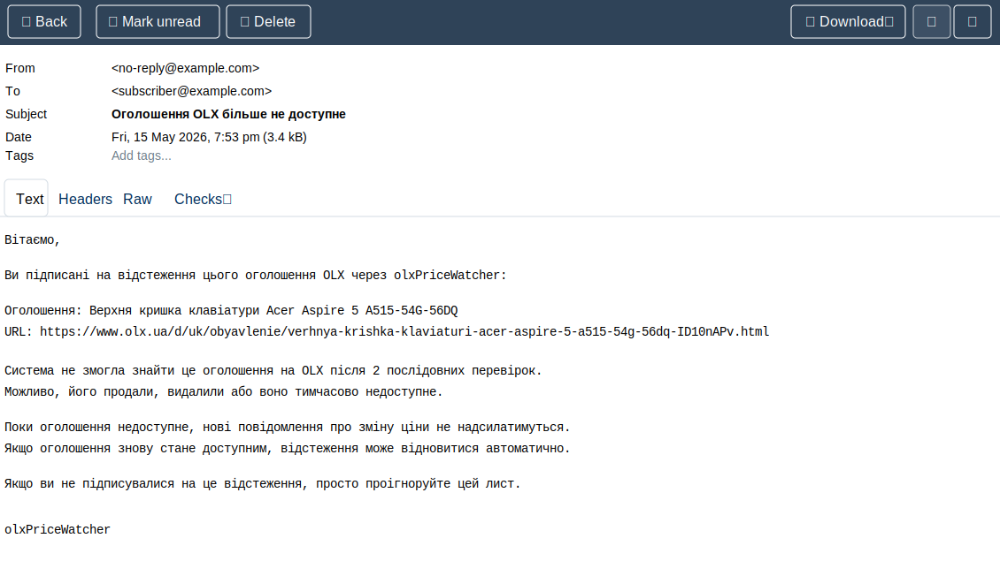

# OLX Price Watcher: Documentation

OLX Price Watcher is a small PHP/Symfony backend service that lets users subscribe to OLX listing price changes. A user submits a listing URL and email address, confirms the subscription, and then the service periodically checks the price and sends an email when it changes.

This document is standalone project documentation: it covers requirements, architecture, data model, API, background worker, email processes, OLX price extraction decisions, quality, and local operation.

## Project goals

The goal of the service is simple: let a user track the price of a specific OLX listing without manually checking the page.

Key requirements:

1. Provide an HTTP endpoint for creating a subscription.
2. Accept an OLX listing URL and email address.
3. Confirm the email before activating the subscription.
4. Check price changes in the background.
5. Send email when the price changes.
6. Do not check the same listing more than once per cycle, even when several users subscribed to it.
7. Run in Docker.
8. Include tests and quality tooling.

The project intentionally stays small. It is not a SaaS platform, so it has no accounts, authorization, dashboard, billing, queues, or microservices.

## Architecture

The system consists of several clear parts:

- HTTP API for subscriptions, email confirmation, health check, and OpenAPI.
- Application handlers for creating subscriptions, confirming subscriptions, and checking prices.
- Domain model for `Listing`, `Subscription`, price fetching, and price history.
- Doctrine ORM for PostgreSQL.
- Symfony Mailer for email notifications.
- A separate Docker worker for regular checks.
- Mailpit for local email inspection.

The main architecture rule: `Listing` is the deduplication root. If several email addresses subscribe to one normalized URL, there is still only one row in the `listings` table, and the worker checks it once.


### Code Structure

- `src/Domain` - domain entities, value objects, statuses, and repository/fetcher interfaces.
- `src/Application` - command handlers for use cases.
- `src/Infrastructure` - Doctrine, Mailer, HTTP client, and OLX extractors.
- `src/UI/Http` - HTTP controllers.
- `src/UI/Console` - console command `app:check-prices`.
- `docker/php/Dockerfile` - shared PHP runtime for `app` and `worker`.
- `docker/worker/run.sh` - background worker loop.

## Architecture principles: SOLID, GRASP, KISS

- SRP: controllers, handlers, entities, repositories, fetchers, and mail templates have separate responsibilities. `EmailFactory` only creates Symfony `Email` objects, while localized subject/body rendering lives in `SymfonyEmailTemplateRenderer` and Symfony Translation files.
- DIP: application and domain code depend on interfaces for price fetching, notification, repositories, clock, and sleeper behavior. Infrastructure classes adapt Doctrine, Symfony Mailer, HTTP fetching, and OLX parsing behind those interfaces.
- GRASP Controller: UI controllers parse the HTTP request, call an application handler, and return a response. They do not own subscription, price tracking, or notification business rules.
- GRASP Information Expert: `Listing` owns OLX listing availability state and counters; `Subscription` owns email confirmation state and notification markers.
- GRASP Low Coupling / High Cohesion: OLX extraction, mail rendering, persistence, and use-case orchestration are separated so each module changes for one main reason.
- KISS: this test assignment intentionally has no account system, dashboard, queue, billing, or SaaS features.

### Docker Layout

Docker Compose has four services:

- `app` - Symfony HTTP application.
- `worker` - background price-checking process.
- `database` - PostgreSQL 16.
- `mailpit` - local SMTP and web UI for emails.

`app` and `worker` are built from the same Dockerfile. This matters: HTTP and background worker processes use the same code and dependencies, but have different main processes.

PostgreSQL is available inside containers as `database:5432`. The `POSTGRES_PORT` variable is only needed for host access. `DATABASE_URL` is not duplicated in `.env.example`; it is built in `docker-compose.yml`.

PostgreSQL data is stored in the named volume `${PROJECT_NAME}_database_data`, so it survives `docker compose down`, Docker restarts, and container recreation. Data is removed only with `docker compose down -v` or manual volume removal.

## API

### GET /

Returns a simple HTML page with useful local links:

- `/health`
- `/api/doc`
- `/openapi.yaml`
- Mailpit UI

### POST /api/subscriptions

Creates or reuses a subscription.

Request example:

```json
{
  "url": "https://www.olx.ua/d/uk/obyavlenie/example-IDdemo123.html",
  "email": "subscriber@example.com"
}
```

Important behavior: the endpoint validates email, normalizes the URL, checks existing active/pending subscriptions, and checks the recipient confirmation-email throttle before fetching OLX. `Listing` and `Subscription` are created only after the request is allowed and the price is fetched successfully. If the listing is not found, the request is throttled, or the price cannot be extracted, no new records are created.

Typical responses:

- `201` - new pending subscription created, confirmation email sent.
- `200` - pending subscription already existed and token was refreshed, or active subscription already exists.
- `429` - confirmation email was recently sent to this email address.
- `400` - invalid JSON.
- `404` - OLX listing not found.
- `422` - invalid email, invalid URL, or price could not be extracted.
- `502` - OLX/network fetch error or confirmation email transport failure.
- `500` - unexpected server/storage error.

Errors are returned as JSON:

```json
{
  "status": "error",
  "message": "message"
}
```

Email is validated with PHP `FILTER_VALIDATE_EMAIL`, so addresses like `1subscriber@example.com` are valid.

If the confirmation email is throttled, the JSON response has status `confirmation_throttled`.

### GET /api/subscriptions/confirm/{token}

Confirms a pending subscription.

Behavior:

- valid pending token -> `200 {"status":"confirmed","message":"Subscription confirmed."}`
- already used active token -> `200 {"status":"already_confirmed","message":"Subscription is already confirmed."}`
- unknown token -> `404`
- expired pending token -> `410`
- unexpected failure -> JSON `500`

Confirmation is subscription-scoped.

### GET /health

Returns:

```json
{
  "status": "ok"
}
```

### OpenAPI

- Swagger UI: `http://localhost:8000/api/doc`
- OpenAPI YAML: `http://localhost:8000/openapi.yaml`

## Data model

### listings

`listings` represents a unique OLX listing.

Key fields:

- `original_url`
- `normalized_url`
- `external_id`
- `current_price`
- `currency`
- `status`
- `last_checked_at`
- `next_check_at`
- `last_error`
- `consecutive_not_found_count`
- `consecutive_fetch_error_count`
- `unavailable_notified_at`

`consecutive_not_found_count` tracks confirmed unavailability: HTTP `404` and `410` both map to `not_found`. `consecutive_fetch_error_count` tracks temporary failures such as HTTP `5xx`, timeouts, and parsing failures, which map to `parse_error`.

`normalized_url` has a unique index. There are also indexes for `status`, `next_check_at`, and a composite index for worker scheduling.

`listings.status` describes OLX listing availability:

- `new`
- `active`
- `not_found`
- `no_price`
- `parse_error`
- `disabled`

### subscriptions

`subscriptions` describes the relationship between an email address and a specific listing.

Key fields:

- `listing_id`
- `email`
- `status`
- `confirmation_token`
- `confirmation_token_expires_at`
- `confirmed_at`
- `last_notified_price`
- `last_notified_at`
- `last_email_sent_at`

There is a `unique(listing_id, email)` constraint that prevents creating a duplicate subscription for the same listing and same email. `confirmation_token` is also unique.

`subscriptions.status` describes the email subscription state:

- `pending`
- `active`
- `unsubscribed`

Email is intentionally stored directly in `subscriptions`. For this task, a separate users/subscribers table is not needed: the subscription itself is the relationship "this email is subscribed to this listing". `last_email_sent_at` is used for simple confirmation-email throttling for the same email subscription.

### price_history

`price_history` stores actual price changes:

- `listing_id`
- `old_price`
- `new_price`
- `currency`
- `source`
- `detected_at`

A record is added only when the new price differs from `listings.current_price`.

## Invariants

1. One OLX listing is checked once per cycle.
2. Several subscribers of one listing do not create several OLX requests.
3. Pending subscriptions do not receive price-change notifications.
4. Email must be confirmed before subscription activation.
5. Price history is written only for an actual price change.
6. If the price did not change, no email is sent.
7. Failure of one listing does not stop the whole worker.
8. Confirmation links are built from `APP_BASE_URL`.
9. If a URL cannot be tracked, `POST /api/subscriptions` creates neither Listing nor Subscription.
10. Pending subscriptions do not make a listing eligible for worker checks.
11. Unavailable notification is sent only after repeated confirmed `not_found` such as HTTP `404` or `410`, not after timeout, HTTP `5xx`, or parser error.
12. Email confirmation is subscription-scoped.
13. A repeated confirmation email for the same email address is not sent more often than `EMAIL_RATE_LIMIT_SECONDS` allows.

## Subscription flow

1. The client sends URL and email to `POST /api/subscriptions`.
2. The API validates JSON, URL, and email.
3. The URL is normalized.
4. The service fetches the current OLX price before creating DB records.
5. If the listing is not found, price is missing, or fetch failed, the API returns a JSON error and stores nothing.
6. Listing is created or reused by normalized URL.
7. Listing is initialized with current price, currency, title, external id, status `active`, `last_checked_at`, and `next_check_at`.
8. Pending subscription is created or reused.
9. For a pending duplicate, token is refreshed and confirmation email is sent again if the recipient email rate limit did not trigger.
10. Active duplicate is not reset to pending and does not receive a new confirmation email.

## Email confirmation flow

1. The user opens the confirmation link from email.
2. Token is searched in `subscriptions`.
3. If the subscription is already active, the endpoint returns `already_confirmed` and changes nothing.
4. If the subscription is pending, expiration is checked.
5. Valid pending subscription becomes active.
6. Active subscription can receive price-change notifications.
7. Unknown token returns `404`; expired pending token returns `410`.

## Price tracking flow

The worker checks only listings that have at least one active subscription. Pending subscriptions never trigger checks.

Steps:

1. Worker runs `php bin/console app:check-prices`.
2. Repository finds due listings with active subscriptions.
3. Price fetcher gets the current price.
4. PriceChangeDetector compares it with `current_price`.
5. If the price changed, `price_history` is created and emails are sent to active subscribers.
6. Listing updates status, counters, timestamps, and next check time.
7. If a listing failed, the worker marks it as `not_found`, `no_price`, or `parse_error` and continues with the next listings.
8. There is a small random delay between OLX requests inside the cycle.

After a full cycle, `docker/worker/run.sh` waits for a random time between `OLX_CHECK_INTERVAL_FROM_SECONDS` and `OLX_CHECK_INTERVAL_TO_SECONDS`.

## Operational logging

Logs are written through Monolog to standard container output. View them with:

```bash
docker compose logs -f app
docker compose logs -f worker
```

The app logs subscription creation failures, notification failures, safe exception metadata, OLX HTTP status/latency, and extractor source used. The worker logs listing ids/URLs being checked, status transitions, not-found/fetch-error counters, and notification send failures.

Logging safety rules: do not log `MAILER_DSN`, SMTP passwords/API keys, confirmation tokens, full OLX HTML responses, or email bodies.

## Notification flow

The service sends three email types:

- confirmation email;
- price changed email;
- listing unavailable email.

Email texts are plain text, without HTML templates. Email language is defined by `LOCALE`: `ua` and `en` are supported, and unknown values fall back to `ua`. Localization uses Symfony Translation, and texts are stored in `translations/emails.ua.yaml` and `translations/emails.en.yaml`. The site name in emails is injected from `PROJECT_NAME`.

Responsibility split:

- `EmailFactory` creates a Symfony `Email`, sets `from`, `to`, `subject`, and body.
- `EmailTemplateRendererInterface` describes rendering for confirmation, price changed, and listing unavailable emails.
- `SymfonyEmailTemplateRenderer` chooses the language and gets subject/body from Symfony Translation domain `emails`.

### Confirmation email

The email contains:

- listing title;
- URL;
- recipient email;
- confirmation link;
- link lifetime;
- explanation of what to do if the user did not create the subscription.

`EMAIL_RATE_LIMIT_SECONDS` sets the minimum number of seconds between confirmation emails for the same email address. If a repeated request arrives earlier, the service does not send an email and does not fetch OLX. Existing pending subscription does not change token and returns JSON status `confirmation_throttled` with HTTP `429`; if there is no subscription to reuse, a new pending subscription is not created.

If Symfony Mailer fails to send the confirmation email, the API returns HTTP `502` with `{"status":"error","message":"Unable to send confirmation email."}`. The raw SMTP/provider error is logged for operators only in redacted form and is not exposed in the API response.

Mailpit inbox shows that confirmation and price-change emails go to the local SMTP container:


Confirmation email example:


### Price changed email

The email contains:

- listing title;
- URL;
- old price;
- new price;
- currency.


### Listing unavailable email

The email is sent only to active subscribers and only after `OLX_UNAVAILABLE_NOTIFICATION_THRESHOLD` consecutive `not_found` results. HTTP `404` and `410` count as `not_found`. Timeout, 5xx, parser error, or `no_price` do not trigger unavailable notification. The notification does not depend on `consecutive_fetch_error_count` and is sent only once until the listing becomes available again.

After the price-change email was captured, the tested listing was deactivated. Mailpit confirms that the service later sent the listing-unavailable email:



### Production anti-spam note

Public subscription endpoints can be abused to send confirmation emails to third-party addresses. `EMAIL_RATE_LIMIT_SECONDS` is not a complete anti-spam system. For a production system, add broader rate limiting, CAPTCHA, IP throttling, unsubscribe links, and sender reputation controls.

### Live SMTP testing with Mailtrap

In addition to local testing through Mailpit, email sending was tested through [Mailtrap Email Sending](https://mailtrap.io/). This check is useful because Mailpit confirms the local SMTP flow, while live SMTP shows that Symfony Mailer works correctly with an external SMTP provider and emails reach a real mailbox.

For live SMTP, replace `MAILER_DSN` in `.env` with the provider DSN and set an allowed sender address in `MAIL_FROM`. If the provider returns `550 5.7.1 Sending from domain example.com is not allowed`, it means the domain or sender address is not allowed by the SMTP provider. This is not a Mailpit error and not a Symfony code error.

After changing SMTP settings, recreate containers:

```bash
docker compose down
docker compose up -d --build
```

Then check the actual configuration:

```bash
docker compose exec app printenv MAILER_DSN
docker compose exec app php bin/console debug:config framework mailer
```

Below are examples of emails delivered through Mailtrap to Gmail.


## Price fetching module

Price fetching is hidden behind `PriceFetcherInterface`, so the data source can be replaced without changing the application flow.

Current implementation:

```text
OlxCompositePriceFetcher
  -> OlxHttpClient
  -> OlxPrerenderedStatePriceExtractor
  -> OlxJsonLdPriceExtractor
  -> OlxHtmlPriceExtractor
```

Final extraction order:

1. `window.__PRERENDERED_STATE__`
2. JSON-LD
3. HTML fallback

`window.__PRERENDERED_STATE__` is primary because OLX already embeds structured listing data in the server-rendered HTML. JSON-LD and visible HTML remain as fallbacks for resilience.

HTTP `404` and `410` map to `not_found`. Missing price on the page maps to `no_price`. Other errors, including HTTP `5xx`, timeouts, and parsing failures, map to `parse_error`.

## Research and architecture notes

Several price extraction approaches were considered during analysis.

### GraphQL API

OLX uses GraphQL internally, but no stable public request for a single listing was found. Available indirect requests, such as `getOtherAdsOfUser`, require `sellerId`, return paginated data, and do not guarantee that the specific listing will be present in the result.

Conclusion: GraphQL is not suitable for reliable price fetching for a specific listing.

### Next.js data endpoint

An endpoint of this form was found:

```text
/_next/data/{buildId}/...ID.json
```

The problem is that `buildId` changes after OLX deployments. For a backend service, this contract is too brittle.

Conclusion: this endpoint was not chosen as the production strategy.

### PRERENDERED_STATE

OLX HTML responses contain serialized state:

```js
window.__PRERENDERED_STATE__
```

It contains structured listing data, including price:

```json
{
  "ad": {
    "ad": {
      "price": {
        "regularPrice": {
          "value": 300,
          "currencyCode": "UAH"
        }
      }
    }
  }
}
```

Advantages:

- does not require authorization;
- present in server-rendered HTML;
- does not depend on unstable internal API;
- contains structured information.

Fallback strategy:

1. `window.__PRERENDERED_STATE__` as the primary source.
2. JSON-LD as fallback.
3. HTML parsing as the last fallback.

The service does not bypass CAPTCHA, auth, bot protection, or rate limits.

## Decisions

### Use Symfony

Symfony was chosen as a stable PHP framework with good support for HTTP, Console, Mailer, DI, config, and testing.

### Use SQL storage

PostgreSQL fits listing deduplication, constraints, indexes, price history, and simple transactional workflows.

### Use worker container instead of cron or supervisor

Cron is inconvenient in Docker because of env, logging, and debugging. Supervisor is not needed because there is no need to run several processes in one container. A separate worker container is simpler and Docker-native.

### Keep email on subscription

A separate users/subscribers table is not needed for the test assignment. `subscriptions.email` and `unique(listing_id, email)` are enough for the current requirements. A subscribers table can be added in the future, but right now it would be unnecessary user-management complexity.

## Quality attributes

### Simplicity

The project follows KISS: minimum moving parts, no SaaS features, and no unnecessary abstractions.

### Testability

Tests cover URL normalization, domain state transitions, subscription flow, worker branches, controller error responses, and OLX extraction edge cases.


### Reliability

Failure of one listing does not stop the worker. Failed fetch outcomes update status and counters, but the cycle continues.

### Developer experience

Docker Compose starts app, worker, database, and Mailpit. There are Swagger UI, OpenAPI YAML, and Composer scripts for quality gates.

## Running and Operating

Clone:

```bash
git clone git@github.com:ukrweb/olxpricewatcher.git
cd olxpricewatcher
```

Create `.env`:

```bash
cp .env.example .env
```

Start:

```bash
docker compose up --build
```

Migrations:

```bash
docker compose exec app php bin/console doctrine:migrations:migrate
```

Useful URLs:

- `http://localhost:8000/`
- `http://localhost:8000/api/doc`
- `http://localhost:8000/openapi.yaml`
- `http://localhost:8000/health`
- `http://localhost:8025`

Quality commands:

After a clean clone or unpacking an archive, Git inside the Docker container may refuse to work with `/app`:

```text
fatal: detected dubious ownership in repository at '/app'
```

This is Git protection against working with a repository whose owner does not match the process user. In this project, `/app` is a bind mount from the host, so this message can appear during `composer qa`, `composer cs-check`, or other commands that indirectly call Git.

Important: the command without the Docker prefix configures Git on the host, not inside the PHP container. The correct command is:

```bash
docker compose exec app git config --global --add safe.directory /app
```

After that, run checks:

```bash
docker compose exec app composer cs-check
docker compose exec app composer phpstan
docker compose exec app composer test
docker compose exec app composer coverage
docker compose exec app composer qa
```

Manual worker run:

```bash
docker compose exec app php bin/console app:check-prices
```

If you change `.env` while containers are running, the safest option is to recreate containers completely:

```bash
docker compose down
docker compose up -d --build
```

After changing `MAILER_DSN`, for example after returning to local Mailpit:

```env
MAILER_DSN=smtp://mailpit:1025
```

check the actual configuration inside the container:

```bash
docker compose exec app printenv MAILER_DSN
docker compose exec app php bin/console debug:config framework mailer
```

Expected value for local email testing is `smtp://mailpit:1025`. If `mailer:test` returns `550 5.7.1 Sending from domain example.com is not allowed`, this is not Mailpit behavior but a live SMTP provider response. In that case, check whether `MAILER_DSN` is overridden in another env/config file:

```bash
grep -R "MAILER_DSN\|smtp-relay\|mailtrap\|demomailtrap\|sandbox.smtp" -n . --exclude-dir=vendor --exclude-dir=var
```

## Patterns and principles

The project uses a lightweight DDD/CQRS style without overengineering:

- Controllers are thin.
- Application handlers coordinate scenarios.
- Domain entities own their state.
- Repositories isolate persistence.
- Price fetching is hidden behind an interface.
- Email creation is extracted into a factory.

GoF patterns appear naturally:

- Strategy for extractors.
- Composite/Chain for fallback price fetching.
- Factory for email creation.
- Repository for persistence.

This is structured enough to maintain, but it does not turn the test assignment into a large platform.
