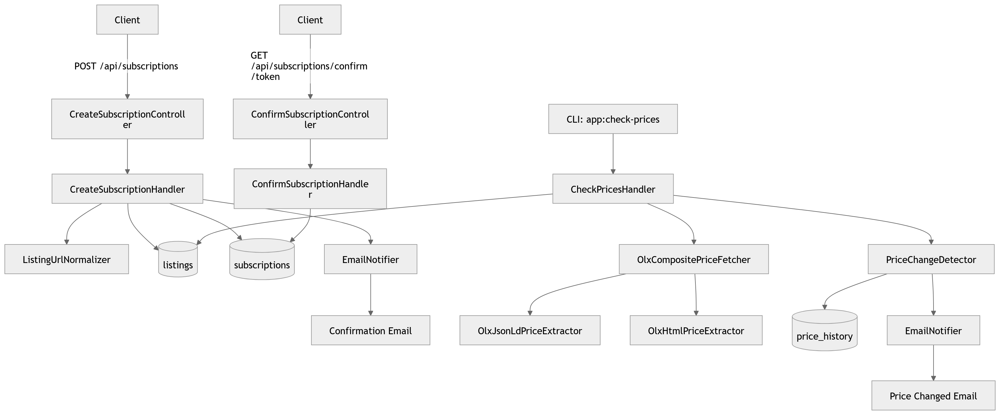
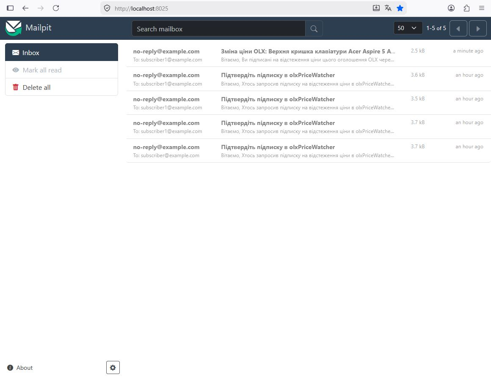
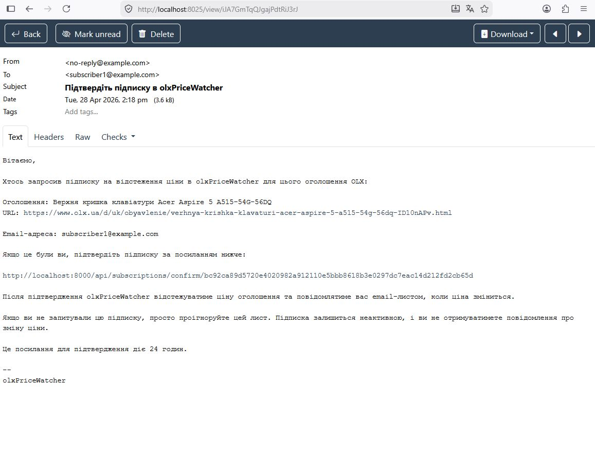
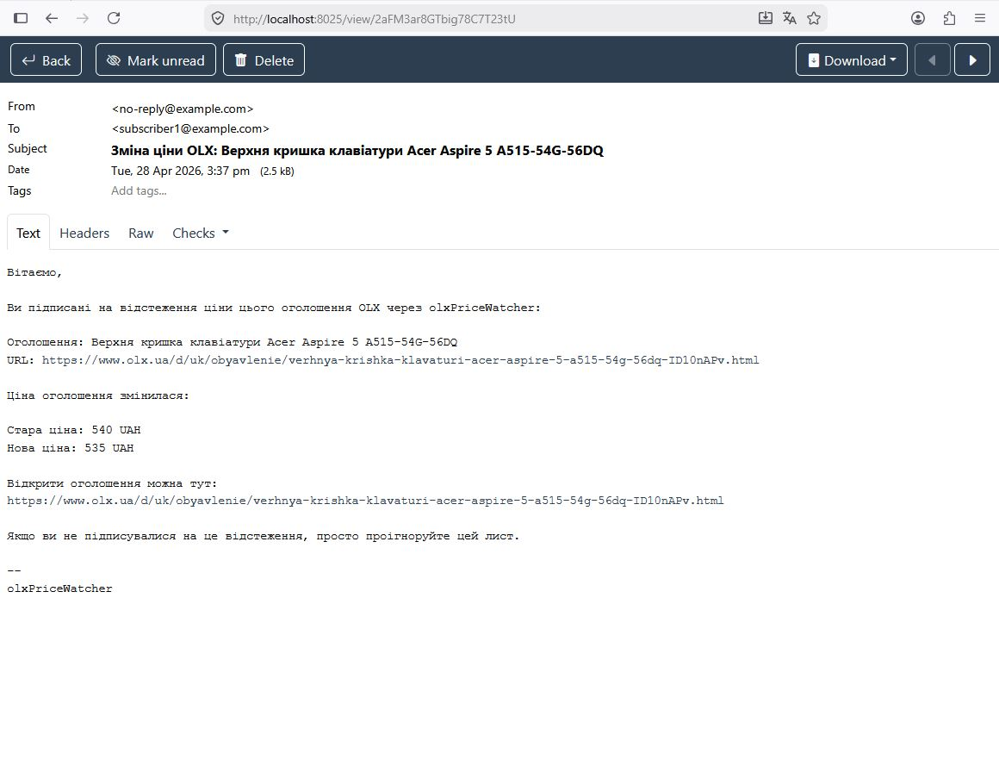
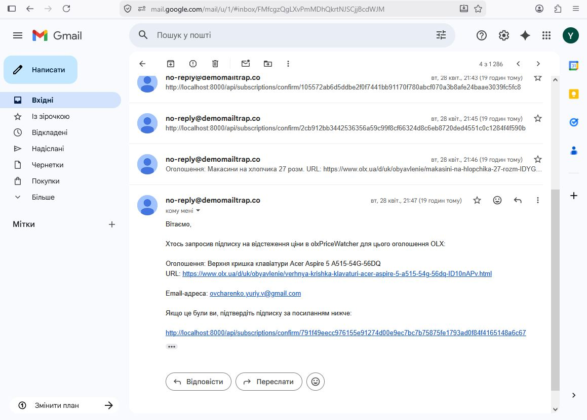
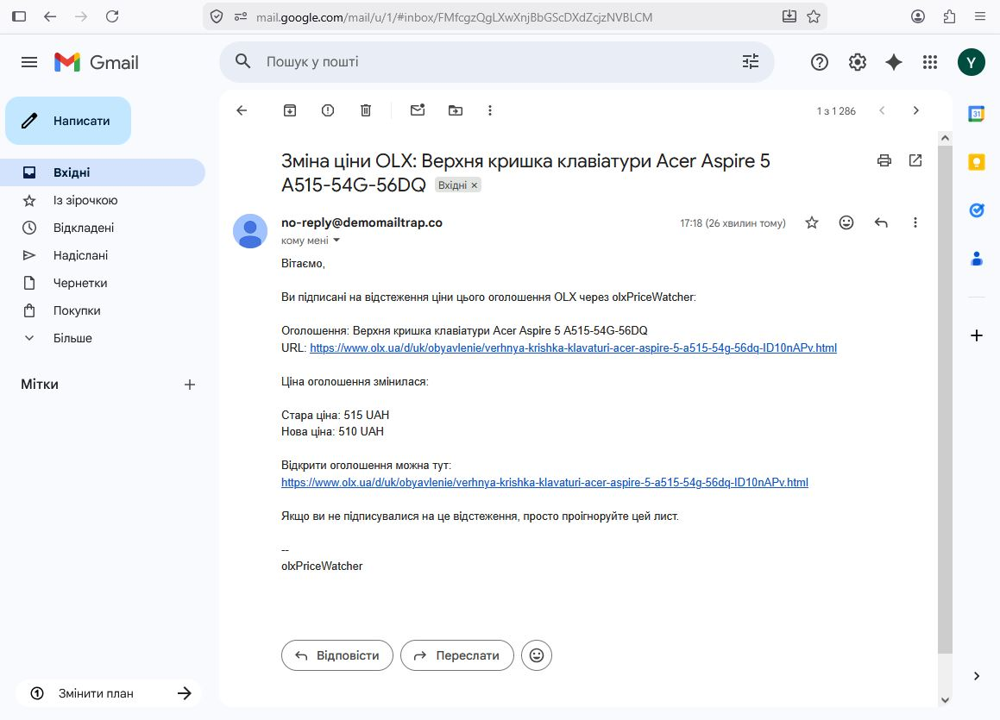
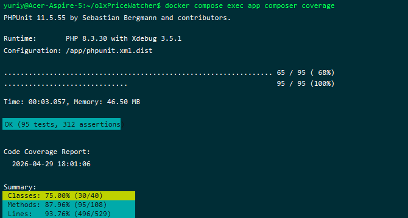

# OLX Price Watcher: документація

OLX Price Watcher - це невеликий backend-сервіс на PHP/Symfony, який дає змогу підписатися на зміну ціни оголошення OLX. Користувач надсилає URL оголошення та email, підтверджує підписку, а далі сервіс періодично перевіряє ціну й надсилає email, якщо вона змінилася.

Цей документ є самостійною документацією проєкту: тут зібрані вимоги, архітектура, модель даних, API, фоновий worker, email-процеси, рішення щодо отримання ціни OLX, якість і локальна експлуатація.

## Project goals

Мета сервісу проста: дозволити користувачу стежити за ціною конкретного OLX-оголошення без ручної перевірки сторінки.

Ключові вимоги:

1. Надати HTTP endpoint для створення підписки.
2. Приймати URL оголошення OLX та email.
3. Підтверджувати email перед активацією підписки.
4. Перевіряти зміну ціни у фоні.
5. Надсилати email при зміні ціни.
6. Не перевіряти одне й те саме оголошення кілька разів за один цикл, навіть якщо на нього підписалося кілька користувачів.
7. Запускатися в Docker.
8. Мати тести й quality tooling.

Проєкт навмисно залишається невеликим. Це не SaaS-платформа, тому тут немає акаунтів, авторизації, dashboard, billing, queues або мікросервісів.

## Architecture

Система складається з кількох чітких частин:

- HTTP API для підписок, підтвердження email, health check і OpenAPI.
- Application handlers для сценаріїв створення підписки, підтвердження та перевірки цін.
- Domain model для `Listing`, `Subscription`, price fetching і price history.
- Doctrine ORM для PostgreSQL.
- Symfony Mailer для email-повідомлень.
- Окремий Docker worker для регулярних перевірок.
- Mailpit для локального перегляду листів.

Головне правило архітектури: `Listing` є коренем дедуплікації. Якщо декілька email-адрес підписалися на один normalized URL, у таблиці `listings` все одно існує один запис, і worker перевіряє його один раз.



### Структура коду

- `src/Domain` - доменні сутності, value objects, статуси та інтерфейси репозиторіїв/fetcher-ів.
- `src/Application` - command handlers для use cases.
- `src/Infrastructure` - Doctrine, Mailer, HTTP client і OLX extractors.
- `src/UI/Http` - HTTP controllers.
- `src/UI/Console` - console command `app:check-prices`.
- `docker/php/Dockerfile` - спільний PHP runtime для `app` і `worker`.
- `docker/worker/run.sh` - цикл фонового worker-а.

### Docker layout

У Docker Compose є чотири сервіси:

- `app` - HTTP застосунок Symfony.
- `worker` - фоновий процес перевірки цін.
- `database` - PostgreSQL 16.
- `mailpit` - локальний SMTP і web UI для листів.

`app` і `worker` будуються з одного Dockerfile. Це важливо: HTTP і background worker мають однаковий код і залежності, але різні головні процеси.

PostgreSQL усередині контейнерів доступний як `database:5432`. Змінна `POSTGRES_PORT` потрібна лише для доступу з хоста. `DATABASE_URL` не дублюється в `.env.example`, а збирається в `docker-compose.yml`.

Дані PostgreSQL зберігаються в named volume `${PROJECT_NAME}_database_data`, тому переживають `docker compose down`, перезапуск Docker і перестворення контейнерів. Дані видаляються тільки через `docker compose down -v` або ручне видалення volume.

## API

### GET /

Повертає просту HTML-сторінку з корисними локальними посиланнями:

- `/health`
- `/api/doc`
- `/openapi.yaml`
- Mailpit UI

### POST /api/subscriptions

Створює або повторно використовує підписку.

Приклад запиту:

```json
{
  "url": "https://www.olx.ua/d/uk/obyavlenie/example-IDdemo123.html",
  "email": "subscriber@example.com"
}
```

Важлива поведінка: endpoint спершу нормалізує URL і пробує отримати поточну ціну OLX. `Listing` і `Subscription` створюються тільки після успішного отримання ціни. Якщо оголошення не знайдено або ціна не витягнута, база не змінюється.

Типові відповіді:

- `201` - нова pending subscription створена, лист підтвердження надіслано.
- `200` - pending subscription існувала й token оновлено або active subscription вже існує.
- `400` - invalid JSON.
- `404` - OLX оголошення не знайдено.
- `422` - invalid email, invalid URL або ціну не вдалося витягнути.
- `502` - OLX/network fetch error.
- `500` - неочікувана server/storage помилка.

Помилки повертаються JSON-ом:

```json
{
  "status": "error",
  "message": "message"
}
```

Email перевіряється через PHP `FILTER_VALIDATE_EMAIL`, тому адреси на кшталт `1subscriber@example.com` є валідними.

### GET /api/subscriptions/confirm/{token}

Підтверджує pending subscription.

Поведінка:

- valid pending token -> `200 {"status":"confirmed","message":"Subscription confirmed."}`
- already used active token -> `200 {"status":"already_confirmed","message":"Subscription is already confirmed."}`
- unknown token -> `404`
- expired pending token -> `410`
- unexpected failure -> JSON `500`

Підтвердження є subscription-scoped.

### GET /health

Повертає:

```json
{
  "status": "ok"
}
```

### OpenAPI

- Swagger UI: `http://localhost:8000/api/doc`
- OpenAPI YAML: `http://localhost:8000/openapi.yaml`

## Data model

### listings

`listings` представляє унікальне OLX-оголошення.

Ключові поля:

- `original_url`
- `normalized_url`
- `external_id`
- `current_price`
- `currency`
- `status`
- `last_checked_at`
- `next_check_at`
- `last_error`
- `consecutive_not_found_count`
- `consecutive_fetch_error_count`
- `unavailable_notified_at`

`normalized_url` має unique index. Також є індекси для `status`, `next_check_at` і composite index для worker scheduling.

`listings.status` описує доступність OLX-оголошення:

- `new`
- `active`
- `not_found`
- `no_price`
- `parse_error`
- `disabled`

### subscriptions

`subscriptions` описує зв'язок email-адреси з конкретним listing.

Ключові поля:

- `listing_id`
- `email`
- `status`
- `confirmation_token`
- `confirmation_token_expires_at`
- `confirmed_at`
- `last_notified_price`
- `last_notified_at`

Є constraint `unique(listing_id, email)`, який не дозволяє створити дубль підписки на те саме оголошення для того самого email. `confirmation_token` також унікальний.

`subscriptions.status` описує стан email-підписки:

- `pending`
- `active`
- `unsubscribed`

Email навмисно зберігається прямо в `subscriptions`. Для цього завдання окрема таблиця users/subscribers не потрібна: підписка сама і є зв'язком "цей email підписаний на це оголошення".

### price_history

`price_history` зберігає фактичні зміни ціни:

- `listing_id`
- `old_price`
- `new_price`
- `currency`
- `source`
- `detected_at`

Запис додається тільки тоді, коли нова ціна відрізняється від `listings.current_price`.

## Invariants

1. Одне OLX-оголошення перевіряється один раз за цикл.
2. Кілька підписників одного listing не створюють кілька OLX-запитів.
3. Pending subscriptions не отримують price-change notifications.
4. Email має бути підтверджений перед активацією підписки.
5. Price history пишеться тільки при реальній зміні ціни.
6. Якщо ціна не змінилася, лист не надсилається.
7. Помилка одного listing не зупиняє весь worker.
8. Confirmation links будуються з `APP_BASE_URL`.
9. Якщо URL неможливо відстежувати, `POST /api/subscriptions` не створює ні Listing, ні Subscription.
10. Pending subscriptions не роблять listing eligible для worker checks.
11. Unavailable notification надсилається тільки після повторних підтверджених `not_found`, не після timeout або parser error.
12. Email confirmation є subscription-scoped.

## Subscription flow

1. Клієнт надсилає URL і email на `POST /api/subscriptions`.
2. API перевіряє JSON, URL і email.
3. URL нормалізується.
4. Сервіс отримує поточну ціну OLX до створення DB-записів.
5. Якщо listing не знайдено, ціна відсутня або fetch failed, API повертає JSON error і нічого не зберігає.
6. Listing створюється або повторно використовується за normalized URL.
7. Listing ініціалізується поточною ціною, валютою, title, external id, status `active`, `last_checked_at` і `next_check_at`.
8. Pending subscription створюється або повторно використовується.
9. Для pending duplicate token оновлюється, і confirmation email надсилається повторно.
10. Active duplicate не скидається в pending і не отримує новий confirmation email.

## Email confirmation flow

1. Користувач відкриває confirmation link з email.
2. Token шукається в `subscriptions`.
3. Якщо subscription вже active, endpoint повертає `already_confirmed` і нічого не змінює.
4. Якщо subscription pending, перевіряється expiration.
5. Valid pending subscription стає active.
6. Active subscription може отримувати price-change notifications.
7. Unknown token повертає `404`, expired pending token - `410`.

## Price tracking flow

Worker перевіряє тільки listings, які мають хоча б одну active subscription. Pending subscriptions ніколи не запускають перевірки.

Кроки:

1. Worker запускає `php bin/console app:check-prices`.
2. Repository знаходить due listings з active subscriptions.
3. Price fetcher отримує поточну ціну.
4. PriceChangeDetector порівнює її з `current_price`.
5. Якщо ціна змінилася, створюється `price_history` і надсилаються листи active subscribers.
6. Listing оновлює status, counters, timestamps і next check time.
7. Якщо listing failed, worker позначає його `not_found`, `no_price` або `parse_error` і продовжує наступні listings.
8. Між OLX-запитами всередині циклу є невелика випадкова затримка.

Після повного циклу `docker/worker/run.sh` чекає випадковий час між `OLX_CHECK_INTERVAL_FROM_SECONDS` і `OLX_CHECK_INTERVAL_TO_SECONDS`.

## Notification flow

Сервіс надсилає три типи листів:

- confirmation email;
- price changed email;
- listing unavailable email.

Тексти листів українською мовою, plain text, без HTML templates. Назва сервісу береться з `PROJECT_NAME`, тому не hard-code-иться в коді листів.

### Confirmation email

Лист містить:

- назву оголошення;
- URL;
- email отримувача;
- confirmation link;
- строк дії link;
- пояснення, що робити, якщо користувач не створював підписку.

Mailpit inbox показує, що confirmation і price-change emails потрапляють у локальний SMTP container:



Приклад confirmation email:



### Price changed email

Лист містить:

- назву оголошення;
- URL;
- стару ціну;
- нову ціну;
- валюту.



### Listing unavailable email

Лист надсилається тільки active subscribers і тільки після `OLX_UNAVAILABLE_NOTIFICATION_THRESHOLD` послідовних `not_found`. Timeout, 5xx, parser error або `no_price` не запускають unavailable notification.

### Live SMTP testing with Mailtrap

Окрім локальної перевірки через Mailpit, відправлення листів було протестовано через [Mailtrap Email Sending](https://mailtrap.io/). Така перевірка корисна, бо Mailpit підтверджує локальний SMTP flow, а live SMTP показує, що Symfony Mailer коректно працює із зовнішнім SMTP-провайдером і листи доходять до реальної поштової скриньки.

Для live SMTP потрібно замінити `MAILER_DSN` у `.env` на DSN провайдера та вказати дозволену адресу відправника в `MAIL_FROM`. Якщо провайдер повертає `550 5.7.1 Sending from domain example.com is not allowed`, це означає, що домен або sender address не дозволені SMTP-провайдером. Це не помилка Mailpit і не помилка Symfony-коду.

Після зміни SMTP-налаштувань потрібно перестворити контейнери:

```bash
docker compose down
docker compose up -d --build
```

Потім перевірити фактичну конфігурацію:

```bash
docker compose exec app printenv MAILER_DSN
docker compose exec app php bin/console debug:config framework mailer
```

Нижче приклади листів, доставлених через Mailtrap до Gmail.





## Price fetching module

Отримання ціни винесено за `PriceFetcherInterface`, щоб джерело даних можна було замінити без зміни application flow.

Поточна реалізація:

```text
OlxCompositePriceFetcher
  -> OlxHttpClient
  -> OlxJsonLdPriceExtractor
  -> OlxHtmlPriceExtractor
```

HTTP `404` мапиться в `not_found`. Відсутність ціни на сторінці - в `no_price`. Network/parser failures - у `parse_error`.

## Research and architecture notes

Під час аналізу були розглянуті кілька способів отримання ціни.

### GraphQL API

OLX використовує GraphQL внутрішньо, але стабільного публічного запиту для одного оголошення не знайдено. Доступні непрямі запити, наприклад `getOtherAdsOfUser`, потребують `sellerId`, повертають paginated data і не гарантують, що конкретне оголошення буде в результаті.

Висновок: GraphQL не підходить для надійного отримання ціни конкретного listing.

### Next.js data endpoint

Було знайдено endpoint виду:

```text
/_next/data/{buildId}/...ID.json
```

Проблема в тому, що `buildId` змінюється після деплоїв OLX. Для backend-сервісу це занадто крихкий контракт.

Висновок: endpoint не обрано як production strategy.

### PRERENDERED_STATE

У HTML-відповіді OLX є serialized state:

```js
window.__PRERENDERED_STATE__
```

Він містить структуровані дані оголошення, включно з ціною:

```json
{
  "ad": {
    "ad": {
      "price": {
        "regularPrice": {
          "value": 300,
          "currencyCode": "UAH"
        }
      }
    }
  }
}
```

Переваги:

- не потребує авторизації;
- присутній у server-rendered HTML;
- не залежить від unstable internal API;
- містить структуровану інформацію.

Fallback strategy:

1. `window.__PRERENDERED_STATE__` як primary source.
2. JSON-LD як fallback.
3. HTML parsing як останній fallback.

Сервіс не обходить CAPTCHA, auth, bot protection або rate limits.

## Рішення

### Use Symfony

Symfony обрано як стабільний PHP framework з якісною підтримкою HTTP, Console, Mailer, DI, config і testing.

### Use SQL storage

PostgreSQL підходить для дедуплікації listings, constraints, індексів, історії цін і простих transactional workflows.

### Use worker container instead of cron or supervisor

Cron незручний у Docker через env, logging і debugging. Supervisor не потрібен, бо немає потреби запускати кілька процесів в одному контейнері. Окремий worker container є простішим і Docker-native.

### Keep email on subscription

Окрема users/subscribers таблиця не потрібна для тестового завдання. `subscriptions.email` і `unique(listing_id, email)` достатні для поточних вимог. У майбутньому можна додати subscribers table, але зараз це було б зайве user-management ускладнення.

## Quality attributes

### Simplicity

Проєкт тримається KISS: мінімум рухомих частин, без SaaS-функцій і зайвих абстракцій.

### Testability

Тестами покриті URL normalization, domain state transitions, subscription flow, worker branches, controller error responses і OLX extraction edge cases.



### Reliability

Помилка одного listing не зупиняє worker. Неуспішні fetch outcomes оновлюють status і counters, але цикл продовжується.

### Developer experience

Docker Compose піднімає app, worker, database і Mailpit. Є Swagger UI, OpenAPI YAML і Composer scripts для quality gates.

## Запуск і експлуатація

Клонування:

```bash
git clone git@github.com:ukrweb/olxpricewatcher.git
cd olxpricewatcher
```

Створення `.env`:

```bash
cp .env.example .env
```

Запуск:

```bash
docker compose up --build
```

Міграції:

```bash
docker compose exec app php bin/console doctrine:migrations:migrate
```

Корисні URL:

- `http://localhost:8000/`
- `http://localhost:8000/api/doc`
- `http://localhost:8000/openapi.yaml`
- `http://localhost:8000/health`
- `http://localhost:8025`

Quality commands:

```bash
docker compose exec app composer cs-check
docker compose exec app composer phpstan
docker compose exec app composer test
docker compose exec app composer coverage
docker compose exec app composer qa
```

Manual worker run:

```bash
docker compose exec app php bin/console app:check-prices
```

Якщо змінюєте `.env` у запущеному контейнері, найнадійніше повністю перестворити контейнери:

```bash
docker compose down
docker compose up -d --build
```

Після зміни `MAILER_DSN`, наприклад після повернення на локальний Mailpit:

```env
MAILER_DSN=smtp://mailpit:1025
```

перевірте фактичну конфігурацію всередині контейнера:

```bash
docker compose exec app printenv MAILER_DSN
docker compose exec app php bin/console debug:config framework mailer
```

Очікуване значення для локальної перевірки листів - `smtp://mailpit:1025`. Якщо `mailer:test` повертає `550 5.7.1 Sending from domain example.com is not allowed`, це не поведінка Mailpit, а відповідь live SMTP-провайдера. Тоді перевірте, чи `MAILER_DSN` не перекривається в іншому env/config файлі:

```bash
grep -R "MAILER_DSN\|smtp-relay\|mailtrap\|demomailtrap\|sandbox.smtp" -n . --exclude-dir=vendor --exclude-dir=var
```

## Patterns and principles

Проєкт використовує легкий DDD/CQRS стиль без overengineering:

- Controllers тонкі.
- Application handlers координують сценарії.
- Domain entities володіють своїм станом.
- Repositories ізолюють persistence.
- Price fetching схований за interface.
- Email creation винесено у factory.

GoF-патерни з'являються природно:

- Strategy для extractors.
- Composite/Chain для fallback price fetching.
- Factory для email creation.
- Repository для persistence.

Це достатньо структуровано для підтримки, але не перетворює тестове завдання на велику платформу.
