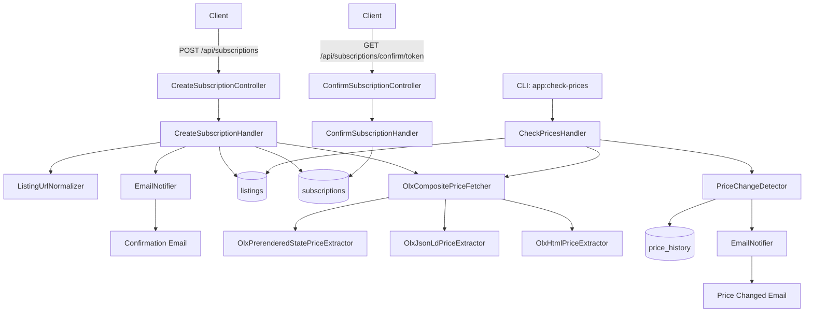

# Architecture

The system is a small Symfony service with:

- HTTP API for subscriptions.
- SQL persistence for listings, subscriptions, and price history.
- CLI command for periodic price checks.
- OLX price fetcher with `window.__PRERENDERED_STATE__` primary extraction, JSON-LD fallback, and HTML fallback.
- Email notification through Symfony Mailer.
- Mailpit in Docker for local email inspection.
- Project name injected from `PROJECT_NAME` for Docker object names and email text.
- Email copy localized through Symfony Translation files under `translations/`.
- Home page at `/`, Swagger UI at `/api/doc`, and OpenAPI YAML at `/openapi.yaml`.
- Separate Docker worker container for periodic price checks.
- Randomized worker sleep interval configured with `OLX_CHECK_INTERVAL_FROM_SECONDS` and `OLX_CHECK_INTERVAL_TO_SECONDS`.
- PostgreSQL reached from containers through the Docker service hostname `database` on port `5432`.

Implementation layout:

- `src/Domain`: Listing, Subscription, and Price concepts plus repository/fetcher contracts.
- `src/Application`: command handlers for subscription and price-tracking workflows.
- `src/Infrastructure`: Doctrine, Symfony Mailer, and OLX HTTP/extraction adapters.
- `src/UI`: HTTP controllers and the `app:check-prices` console command.
- `docker/php/Dockerfile`: shared PHP image for app and worker services.
- `docker/php/php.ini` and `docker/php/xdebug.ini`: template-based PHP/Xdebug configuration rendered from `.env` values.
- `docker/worker/run.sh`: worker loop used by the `worker` Compose service.

Docker note: `POSTGRES_PORT` is only the host port mapping. `DATABASE_URL` inside `app` and `worker` must use `database:5432`, not `localhost`.

Persistence note: PostgreSQL data is stored in a named Docker volume derived from `PROJECT_NAME`, for example `${PROJECT_NAME}_database_data`. It survives `docker compose down`, container recreation, and Docker restarts. It is removed only by `docker compose down -v` or manual Docker volume deletion.

Worker note: `docker/worker/run.sh` fails fast when `OLX_CHECK_INTERVAL_FROM_SECONDS` is greater than `OLX_CHECK_INTERVAL_TO_SECONDS`. Inside one worker cycle, the application adds a small random delay between OLX listing requests.

## Architecture principles: SOLID, GRASP, KISS

- SRP: controllers, handlers, entities, repositories, fetchers, and mail templates have separate responsibilities.
- DIP: application and domain code depend on interfaces for price fetching, notification, repositories, clock, and sleeper behavior.
- GRASP Controller: UI controllers only parse requests, call application handlers, and return responses.
- GRASP Information Expert: `Listing` owns listing availability state; `Subscription` owns confirmation and email-throttle state.
- GRASP Low Coupling / High Cohesion: OLX extraction, mail rendering, persistence, and use-case orchestration are separated.
- KISS: no account system, dashboard, queue, billing, or SaaS features.

